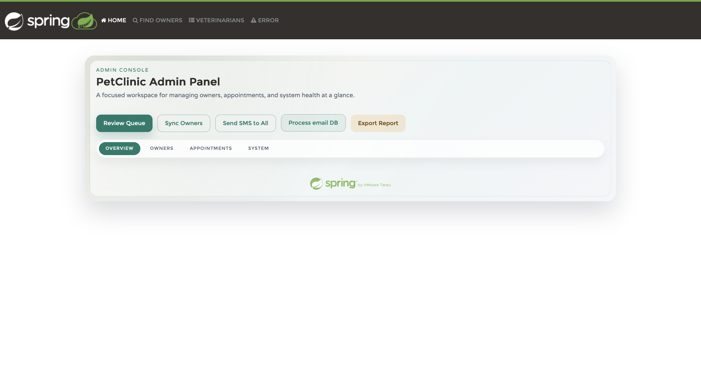
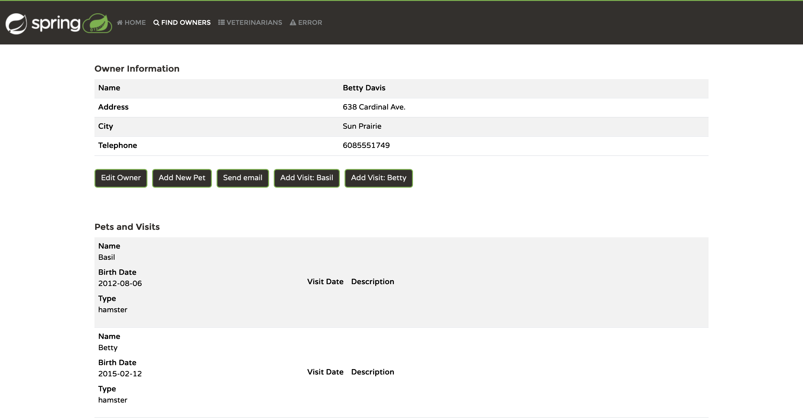
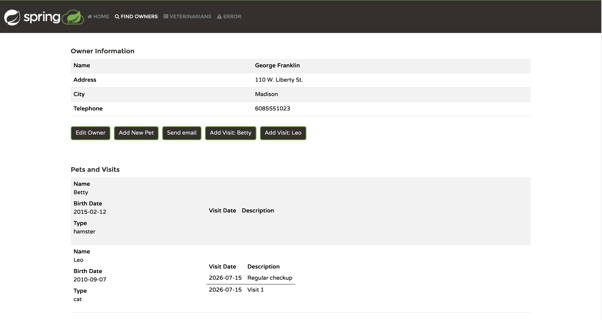
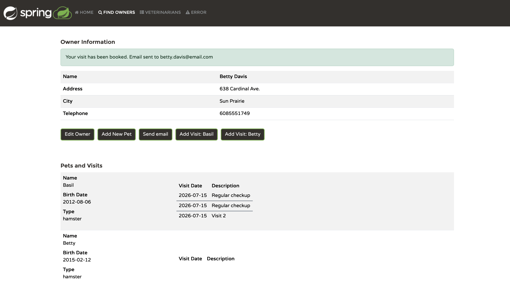
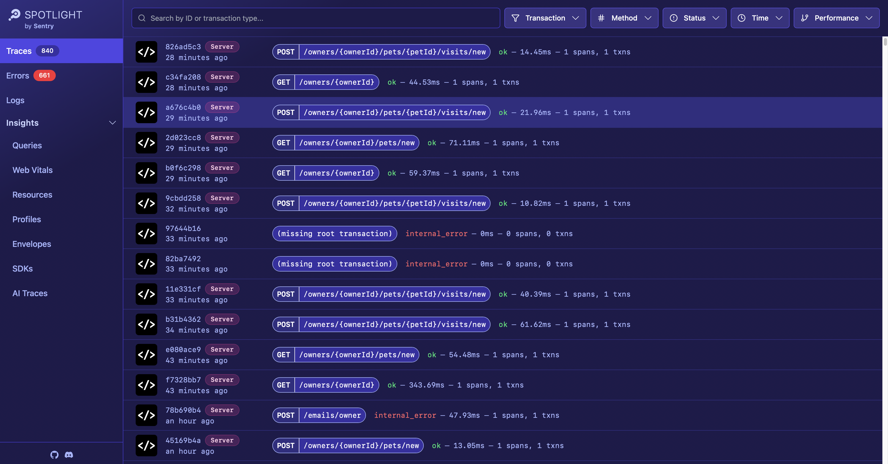
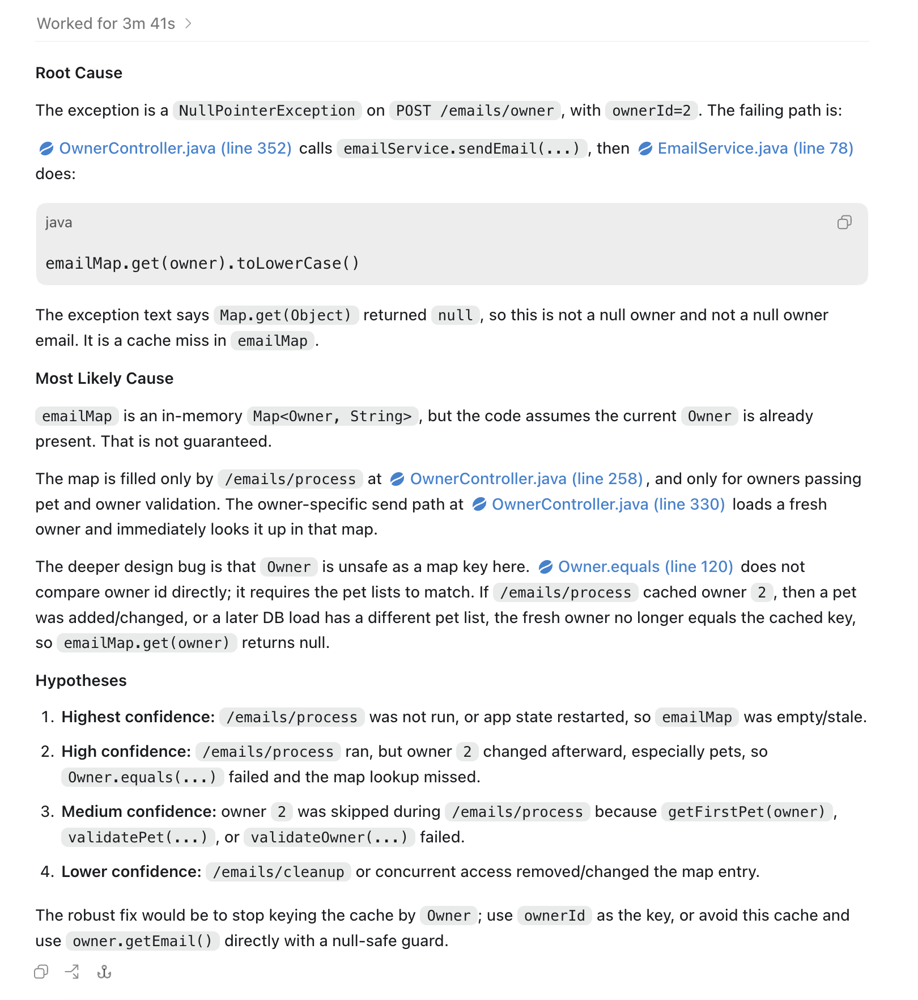
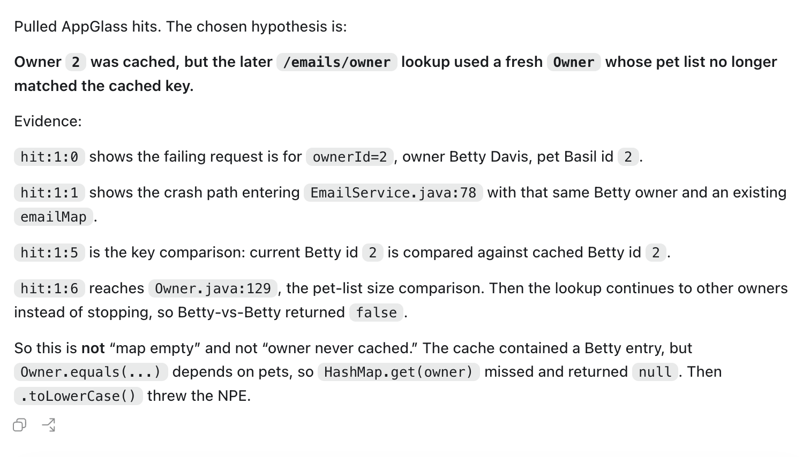
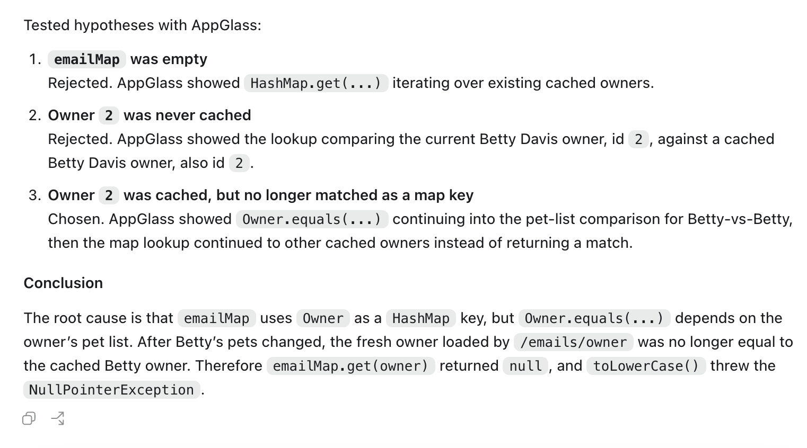

# PetClinic AppGlass Demo

This repository is a fork of the original **Spring PetClinic** application with **two intentionally introduced bugs**.  
It exists to demonstrate the value of a **AppGlass** for investigating problems directly in a running application.

## Run Petclinic locally

Spring Petclinic is a [Spring Boot](https://spring.io/guides/gs/spring-boot) application built using [Gradle](https://spring.io/guides/gs/gradle/).
Java 17 or later is required for the build, and the application can run with Java 17 or newer.

You can start the application locally from the command line:

```bash
./gradlew bootRun
```

Alternatively, you can build the Docker image:

```bash
./gradlew jibDockerBuild
```

You can then access the Petclinic at <http://localhost:8080/>.

## Demo Scenarios (Intentional Bugs)

### 1) HTTP 500 on POST request

This scenario starts with the email flow working correctly, then shows how adding a pet can trigger an unhandled exception.

#### Reproduce

1. Process emails:

```bash
curl -i -X POST http://localhost:8080/emails/process
```

2. Verify that sending email to owner `2` works:

```bash
curl -i -X POST http://localhost:8080/emails/owner -d "ownerId=2"
```

This request should complete without an error.

3. Add a new pet for owner `2`:

```bash
curl -i -X POST http://localhost:8080/owners/2/pets/new \
  -d "name=Sally" \
  -d "birthDate=2015-02-12" \
  -d "type=hamster"
```

4. Send the owner email again:

```bash
curl -i -X POST http://localhost:8080/emails/owner -d "ownerId=2"
```

#### UI Walkthrough

You can reproduce the same flow from the application UI:

1. Open the admin panel and click **Process email DB**.



2. Open owner `2`, click **Add New Pet**, add the new pet, then click **Send email**.



#### Failure

The second `/emails/owner` request now returns HTTP 500. The application logs a `NullPointerException` similar to:

```text
Request processing failed: java.lang.NullPointerException:
Cannot invoke "String.toLowerCase()" because the return value of "java.util.Map.get(Object)" is null

java.lang.NullPointerException: Cannot invoke "String.toLowerCase()" because the return value of "java.util.Map.get(Object)" is null
    at org.springframework.samples.petclinic.owner.EmailService.sendEmail(EmailService.java:78)
    at org.springframework.samples.petclinic.owner.OwnerController.sendEmailsToOwner(OwnerController.java:352)
    ...
```

#### Root Cause

The `Owner.equals(...)` implementation depends on the owner's pets. After a new pet is added, the updated `Owner` is no longer equal to the older `Owner` instance used as a key in `emailMap`.

```java
@Override
public boolean equals(Object other) {
    if (this == other) {
        return true;
    }
    if (!(other instanceof Owner owner)) {
        return false;
    }
    return this.getId() != null && owner.getId() != null && hasSamePets(owner);
}
```

When the email flow looks up the updated owner in `emailMap`, the map cannot find the original key and returns `null`. The email service then calls `toLowerCase()` on that `null` value, causing the HTTP 500 response.

### 2) Silent Logic Bug

This scenario has no HTTP 500 and no visible error. The visit is saved, but the email notification behaves differently depending on the owner.

#### Reproduce

1. Add a visit for owner `1`:

```bash
curl -i -L http://localhost:8080/owners/1/pets/1/visits/new \
  -d "date=2026-07-15" \
  -d "description=Regular checkup"
```

The visit appears on the owner page, but there is no success notification and no email-related log entry.



2. Add a visit for owner `2`:

```bash
curl -i -L http://localhost:8080/owners/2/pets/1/visits/new \
  -d "date=2026-07-15" \
  -d "description=Regular checkup"
```

This time the visit is saved and the application shows the email notification.



#### Failure

Both requests save the visit successfully, but only owner `2` gets the expected email flow. Owner `1` silently skips the email step, which makes the bug difficult to notice from the UI alone.

#### Root Cause

The email is sent only when both the pet and owner validation pass:

```java
if (validatePet(pet) && validationService.validateOwner(owner)) {
    String message = "Your visit has been booked. Email sent to " + owner.getEmail();
    sendEmail(owner.getEmail(), message);
    redirectAttributes.addFlashAttribute("message", message);
}
```

The `validateOwner(...)` check also validates the owner's telephone number. When this validation fails for owner `1`, the method exits without sending an email, without showing an error, and without logging why the notification was skipped.

### 3) Full demo scenario

This scenario combines the HTTP 500 bug with Sentry Spotlight and an LLM-based root-cause analysis workflow.

#### Setup

1. Start Sentry Spotlight:

```bash
docker run --rm -p 8969:8969 \
  --name sentry-spotlight \
  ghcr.io/getsentry/spotlight:latest
```

2. Process the email database:

```bash
curl -i -X POST http://localhost:8080/emails/process
```

3. Verify that sending email to owner `2` works:

```bash
curl -i -X POST http://localhost:8080/emails/owner -d "ownerId=2"
```

This request should complete without an error.

4. Add a new pet for owner `2`:

```bash
curl -i -X POST http://localhost:8080/owners/2/pets/new \
  -d "name=Sally" \
  -d "birthDate=2015-02-12" \
  -d "type=hamster"
```

5. Run the reproducer:

```bash
python3 reproducer.py
```

#### Inspect the Trace

Open Sentry Spotlight:

```http
http://localhost:8969/telemetry
```

After the reproducer starts, Spotlight shows repeated requests and the failing `POST /emails/owner` transaction.



Open an error record and inspect its details and context. Example links:

```http
http://localhost:8969/telemetry/errors/eeabe1500dec4aa196a6374d371085db/details
http://localhost:8969/telemetry/errors/eeabe1500dec4aa196a6374d371085db/contexts
```

#### Ask for Root-Cause Analysis

Ask an LLM to analyze only the Java source files plus the exception details:

```text
Task: You cannot reproduce the issue and you cannot see the database.
Analyze only the Java source files and the exception itself.
Make a root-cause analysis. If you are not sure, give a list of root-cause hypotheses.

Stacktrace:
http://localhost:8969/telemetry/errors/eeabe1500dec4aa196a6374d371085db/details

Context:
http://localhost:8969/telemetry/errors/eeabe1500dec4aa196a6374d371085db/contexts
```

Example RCA output:



The LLM can identify useful hypotheses, including the correct one: owner `2` was cached as a key, and after a pet was added or changed, the fresh owner no longer equals the cached key, so `emailMap.get(owner)` returns `null`. However, without runtime evidence, it may not rank the true root cause first.

#### Validate with AppGlass

Now enable AppGlass MCP and ask the LLM to validate the hypotheses against runtime tracepoint data.



With AppGlass evidence, the LLM can confidently choose the root cause instead of only listing likely hypotheses.



## License

The Spring PetClinic sample application is released under version 2.0 of the [Apache License](https://www.apache.org/licenses/LICENSE-2.0).

<!-- Linear <-> GitHub integration test (AG-607); safe to merge or close. -->
